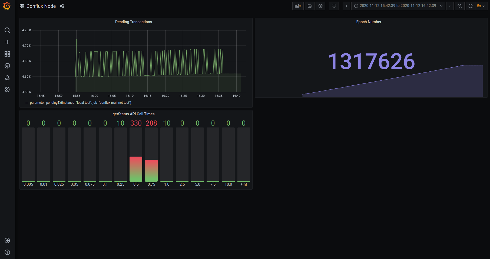

# Prometheus Metrics

Demo integration showing Gantree technology and Conflux Network working together. This repository contains a Prometheus Metrics server that is needed to provide data in a standardized format to Gantree (and can be used for other Prometheus interfaces).

## Metrics Description
Current metrics that are exported:
- Node version and chain ID (`node_info`)
- Epoch Number (`parameter_epochNumber`)
- Transactions in the TX pool (`parameter_pendingTx`)
- API request time for `cfx_getStatus` (`request_getStatus_seconds`)

## Gantree Implementation
Current implementation connects a remote conflux endpoint with a Grafana dashboard (seen below). The connection involves a few intermediary pieces:
1. A Prometheus Metrics server (this repository)
2. Gantree node watchdog ([repository](https://github.com/gantree-io/gantree-node-watchdog))
3. Gantree dashboard ([link](https://app.gantree.io/))



The connections can be illustrated with the following:
```
Conflux Node <=> Metrics Server <=> Watchdog <=> Gantree Backend <=> Grafana
```

## Server Setup
To set up, the connection the configuration file contains the default values. The `PORT` configures the port number of the Prometheus Metrics server. The `CYCLE` is how often the server queries the blockchain to get parameters. The `ENDPOINT` can be changed to any endpoint that is needed.
```python
# port number for server (default)
PORT=9615

# Run every X seconds
CYCLE=2

# conflux endpoint
ENDPOINT="http://main.confluxrpc.org"
```

The server can then be started with (assuming all necessary packages are installed):
```
python3 main.py
```

## Gantree Connection
Then following the [Gantree setup tutorial](https://www.youtube.com/watch?v=mpyn-lhcxbs&feature=youtu.be), start the Gantree watchdog with the following commands:
```
curl -o- https://raw.githubusercontent.com/gantree-io/gantree-node-watchdog/master/quick-install.sh | bash
cd gantree-node-watchdog-v*.*.*-linux
./bin/gantree_node_watchdog
```

The video tutorial then explains how to retrieve an API key from the [Gantree frontend](https://app.gantree.io/), how to start a new monitoring network, and connect it to a monitoring dashboard in Grafana.

## Resources & Notes
Additional work:
- [x] Integrate with a local node to access more functions and metrics (using the CLI sub commands)
- [ ] Implement `./conflux rpc local net session` for CLI sub commands
- [ ] Support additional OS (test on Mac, support Windows) for local node metrics

Useful links:
- Conflux commands accessible by JSON-RPC (remote node): https://developer.conflux-chain.org/docs/conflux-doc/docs/json_rpc
- Conflux commands accesible by CLI (local node): https://developer.conflux-chain.org/docs/conflux-doc/docs/cli_sub_commands
- Prometheus client: https://github.com/prometheus/client_python
- Gantree dashboard: https://app.gantree.io/
- Gantree setup tutorial: https://www.youtube.com/watch?v=mpyn-lhcxbs&feature=youtu.be
- Gantree watchdog: https://github.com/gantree-io/gantree-node-watchdog
